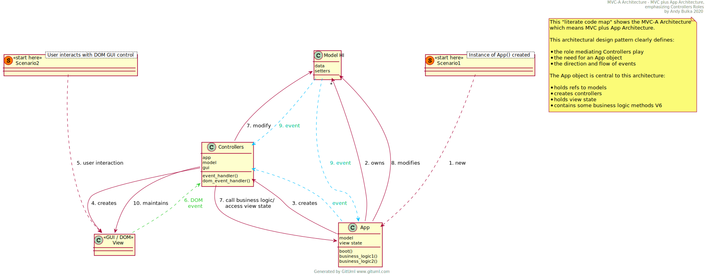

# pagestest
testing github pages

hi there.  [live demo](https://tcab.github.io/pagestest/).

## Overview

README.md is served via the usual https://github.com/tcab/pagestest

Github Pages version is taken from /docs and served via https://tcab.github.io/pagestest/ 

There is no local Jeckyl building being done, its all default Github Pages jekyl building done on the server. We can use variables locally and they work etc.

```
.
├── README.md
├── docs
│   ├── _config.yml
│   ├── _data
│   │   └── people.yml
│   ├── assets
│   │   └── img
│   │       └── header.jpg
│   ├── images
│   │   └── mvc-a-architecture.svg
│   ├── index.md
│   ├── page2.md
│   └── plantuml
│       └── example-01.puml
├── index.html
└── index.md
```

## Misc

see also the `hello.yml` file in .github/workflows which apparently spins up ubuntu and then runs some commands - every time you push?

Interesting, so when you have the 'github pages' set to main master, it just uses your normal `README.md` as its content.

So what if we add an `index.md` ? Yes, it then takes priority 👍

What about if we add `index.html` ?  Yes it does. 🧐 Which means if `index.html` is part of your project itself, then it will inadvertently be displayed.  Note that all auto magic theme style info is stripped when displaying `index.html` - presumably this gives you freedom to totally style as you wish.

## Ok, let's try a /docs subdir now....

Of course you have to change repo settings... 
And you have to re-select a theme, so that the `_config.yml` is created in the `/docs` dir.  Presumably you could move the `_config.yml` into the `/docs` dir instead of having to reselect the theme.

Works OK.

## Using the "minimal theme"
Doco on the minimal theme can be found [here](https://github.com/pages-themes/minimal) - it seems you need to:

Configuration variables

Minimal will respect the following variables, if set in your site's `_config.yml`:

```yml
title: [The title of your site]
description: [A short description of your site's purpose]
```

Additionally, you may choose to set the following optional variables:

```yml
logo: [Location of the logo]
show_downloads: ["true" or "false" to indicate whether to provide a download URL]
google_analytics: [Your Google Analytics tracking ID]
```

Tip: The `[]` brackets are not needed and must be replaced with your content.
e.g.

```yml
theme: jekyll-theme-minimal
logo: https://user-images.githubusercontent.com/830777/76915877-dc9fa800-6912-11ea-8c1a-08a0ab767f1a.jpg
```

## Inserting Images

Great [tip](https://ardalis.com/add-images-easily-to-github): simply **paste** an image into a dummy GitHub *issue* and the markdown is created for you - discard the issue when done.  The image is __hosted somewhere internally inside GitHub__. 🤗


## SVG (github main page README.md)

Tested on:

- a regular github markdown page e.g. `README.md`
- a jeckyll generated github page markdown page
- locally in vscode markdown previewer
- TODO local jekyl hosted serving

### Summary

|      XX         | **GitHub README.md**           | **GitHub Pages via /docs** |  Comment |
| sanitised raw | perfect                        | perfect  | The sanitised raw technique works perfectly in all scenarios, but it does mean precending all your image url references with `https://raw.githubusercontent.com/tcab/pagestest/master/` |
| naive         | ok but ugly github framed page | perfect  | Thus if its just GitHub Pages hosting, the naive technique is fine - even though the url has an extra part to it its still a short, easy url, with no `raw.githubusercontent.com` urls.  Naive technique not suitable on Github main page e,g, README.md due to the ugly github framed page issue - unless you are not expecting people to click on your images. |
| regeneration  | ok but flaky                   | flaky    | Flakiness is not good, even though this technique has the benefit of dynamically regenerating SVG files from PlantUML markdown source |

Note:
- all "GitHub Pages via /docs" techniques need extra syntax to the url to get clickable link
- perfect means "works, and has nice link to full browser page svg where you can zoom"


| Command | Description |
| --- | --- |
| git status | List all new or modified files |
| git diff | Show file differences that haven't been staged |


### 1 - "Sanitised raw" technique

```
https://raw.githubusercontent.com/tcab/pagestest/master/docs/images/mvc-a-architecture.svg?sanitize=true
```

Need to add `?sanitize=true` for this to work, as per [this post](https://github.community/t5/How-to-use-Git-and-GitHub/Embedding-a-SVG/td-p/2192):


- works locally on dev machine
- works on github main page README.md ✅
- nice link to full browser page svg where you can zoom ✅


### 2 - "Naive" technique

```
./docs/images/mvc-a-architecture.svg
```



- works locally on dev machine
- works on main github README ✅
- CLICKING ON IMAGE - takes you to ugly github framed page  ❌ mitigation fails - same ugly page ❌
- Note that `?sanitize=true` not needed, though doesn't hurt.

Even though it makes for more complex urls, try to mitigate the **ugly github framed page** problem with the advice:
> In other words, whatever the syntax for the image, treat that whole syntax as the text to link. So the ugly syntax also works: `[](web link)`
[](./docs/images/mvc-a-architecture.svg)


### 3 - "Regeneration" from .puml technique

```
http://www.plantuml.com/plantuml/proxy?cache=no&src=https://raw.github.com/abulka/lcodemaps/master/plantuml/example-01.puml&fmt=svg
http://www.plantuml.com/plantuml/proxy?fmt=svg&cache=no&src=https://raw.github.com/tcab/pagestest/master/docs/plantuml/example-01.puml
```
*(latter link version is for a different plantuml file, but also, has the `&fmt=svg` fragment earlier in the url which makes it more understandable)*


- works on main github README, but... too slow to refresh, sometimes image fails to appear probably due to timeout ✅😯
- CLICKING ON IMAGE works and takes you to some `https://camo.githubusercontent.com/...` url where you get the full screen SVG and can zoom ok ✅😯 unreliable and too slow to refresh
- does not work locally on dev machine - at least not in vscode previewer.
- *may* work in local jekyll server but this project isn't set up with local jekill

#### more regeneration variant ideas

What about if I take the *caching flag off** the regeneration technique? ✅ (but will it regen when plantuml changes? nope ❌but the above flaky example does update cos it has caching off)


What about if I refer to take the caching flag off the regeneration technique and refer to ✅
- raw.githubusercontent.com insead of 
- raw.github.com

cached - regens ok? 


non cached (`&cache=no&`) - regens ok? 


TODO: what if I use sanitize in the url? perhaps I don't need to consider this since the sanitisation is for serving the image, whereas here we are merely passing the raw text content to plantuml server.

